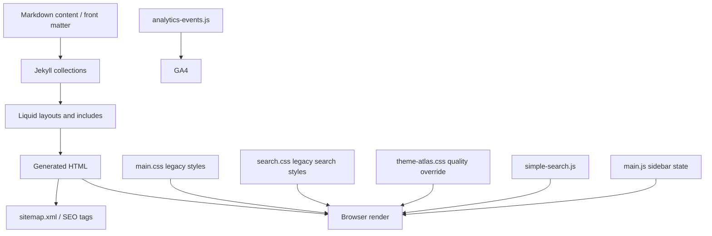

# 1. 목적

이 HLD는 Allen's Blog의 시각 시스템, 검색/사이드바 상호작용, 포스트/시리즈/도구 정보 구조, 운영 문서를 하나의 정적 사이트 품질 시스템으로 설명한다.

# 2. 시스템 개요

Allen's Blog는 Jekyll 기반 GitHub Pages 정적 사이트다. 콘텐츠는 Markdown과 Liquid layout으로 생성되고, UI 품질은 전역 CSS override와 소량의 JavaScript로 유지한다.

# 3. 주요 설계 목표

- 정적 배포 호환성: GitHub Pages에서 빌드 가능한 Liquid, CSS, JS만 사용한다.
- 읽기 우선: 긴 글은 760px 안팎의 본문 폭과 명확한 섹션 흐름을 유지한다.
- 탐색 단순성: 사이드바, 검색, 카테고리, 시리즈 허브를 명확한 라벨로 제공한다.
- 운영 가능성: Search Console, GA4, 콘텐츠 갱신 루틴을 문서화한다.
- 회귀 방지: 변경 후 빌드, JS 문법, 브라우저 확인, 대비 확인을 수행한다.

# 4. 논리 아키텍처

## Presentation Layer

- `_layouts/default.html`: 전체 구조와 사이드바, 본문, footer를 조합한다.
- `_layouts/post.html`: 글 상세 구조, 메타데이터, 학습 목표, 목차, 시리즈, 댓글을 렌더링한다.
- `_pages/*.md|html`: 정적 페이지와 허브 페이지를 정의한다.
- `_includes/components/sidebar.html`: 검색, 내비게이션, 카테고리, 소셜 링크를 제공한다.
- `_includes/components/search-form.html`: 검색 입력과 결과 영역을 제공한다.

## Style System

- `assets/css/main.css`: 기존 SCSS 컴파일 결과와 기본 스타일.
- `assets/css/search.css`: 기존 검색 컴포넌트 스타일.
- `assets/css/sidebar-toggle.css`: 사이드바 토글 버튼과 모바일 드로어 동작 스타일.
- `assets/css/theme-atlas.css`: 최종 시각 품질 override 계층. 현재 가장 높은 우선순위의 제품 디자인 규칙이다.

## Behavior Layer

- `assets/js/main.js`: 사이드바 열림/닫힘, 포커스, 배경 잠금, 반응형 상태 관리.
- `assets/js/simple-search.js`: `/search.json` 로딩, 검색, 하이라이트, 결과 표시, URL `q` 동기화.
- `assets/js/tools.js`: 계산기, 물리 계산기, 단위 변환기 동작.
- `assets/js/analytics-events.js`: GA4 이벤트 전송.

## Content and Operations Layer

- `_posts/`: 포스트 본문과 front matter.
- `tools/`: 도구별 SEO 랜딩 페이지.
- `BLOG_OPERATIONS.md`: Search Console, GA4, 발행 루틴.
- `CONTENT_STRATEGY.md`: 주제별 콘텐츠 운영 원칙.
- `DESIGN.md`: 디자인 방향과 토큰 설명.
- `docs/`: 제품/설계/테스트/의사결정 문서.

# 5. 주요 사용자 흐름

## 글 읽기 흐름

1. 방문자가 글 목록 또는 검색 결과에서 포스트로 이동한다.
2. 포스트 상단에서 제목, 작성일, 갱신일, 카테고리를 확인한다.
3. “이 글에서 얻는 것”과 목차로 글의 흐름을 파악한다.
4. 본문을 읽고 하단에서 다음 글, 관련 글, 참고 자료, 댓글로 이동한다.

## 검색 흐름

1. 방문자가 사이드바를 열고 검색어를 입력한다.
2. `simple-search.js`가 `/search.json`을 로드해 결과를 계산한다.
3. 결과는 제목, 카테고리, 날짜, 요약으로 표시된다.
4. 사용자가 검색 결과를 선택하거나 Escape로 결과를 닫는다.

## 도구 사용 흐름

1. 방문자가 `/tools/`에서 개별 도구 안내 또는 통합 계산기를 선택한다.
2. 탭을 전환하면 `aria-selected`와 `hidden` 상태가 바뀐다.
3. 계산 결과 또는 오류 안내가 live region에 표시된다.

# 6. 품질 게이트

| 게이트 | 목적 | 명령/검증 |
| --- | --- | --- |
| Git diff check | 공백/패치 오류 방지 | `git diff --check` |
| JS syntax | 변경 JS 문법 검증 | `node --check assets/js/simple-search.js` |
| Jekyll build | 정적 사이트 빌드 검증 | `bundle exec jekyll build` |
| Browser smoke | 주요 페이지 렌더링 확인 | `/posts/`, `/series/`, `/tools/`, `/about/`, 대표 포스트 |
| Contrast check | 핵심 색상 대비 확인 | 색상 대비 스크립트 또는 브라우저 감사 |
| Documentation check | 운영 문서 최신성 확인 | PRD/HLD/LLD/TDD/ADR/검토 보고서 갱신 |

# 7. 주요 리스크

- 페이지별 인라인 `<style>`이 전역 override와 충돌할 수 있다.
- `DESIGN.md` 토큰과 실제 `theme-atlas.css` 토큰이 어긋날 수 있다.
- 외부 스크립트(GA4, FontAwesome, Utterances)는 네트워크 상태에 따라 로컬 검증이 제한된다.
- Search Console과 GA4 콘솔 상태는 저장소만으로 확인할 수 없다.

# 8. 운영 모델

- 새 UI 변경은 `theme-atlas.css` 중심으로 적용한다.
- 새 페이지는 기존 layout/include를 사용하고, page-specific style을 최소화한다.
- 새 글은 `learning_outcomes`, `references`, `date_modified` 정책을 따른다.
- 새 도구는 통합 `/tools/` 노출과 개별 `/tools/<slug>/` SEO 페이지를 함께 고려한다.

# 9. 변경 이력

| 날짜 | 버전 | 작성자 | 변경 |
| --- | --- | --- | --- |
| 2026-05-05 | v1 | Codex | 초기 HLD 작성 |
