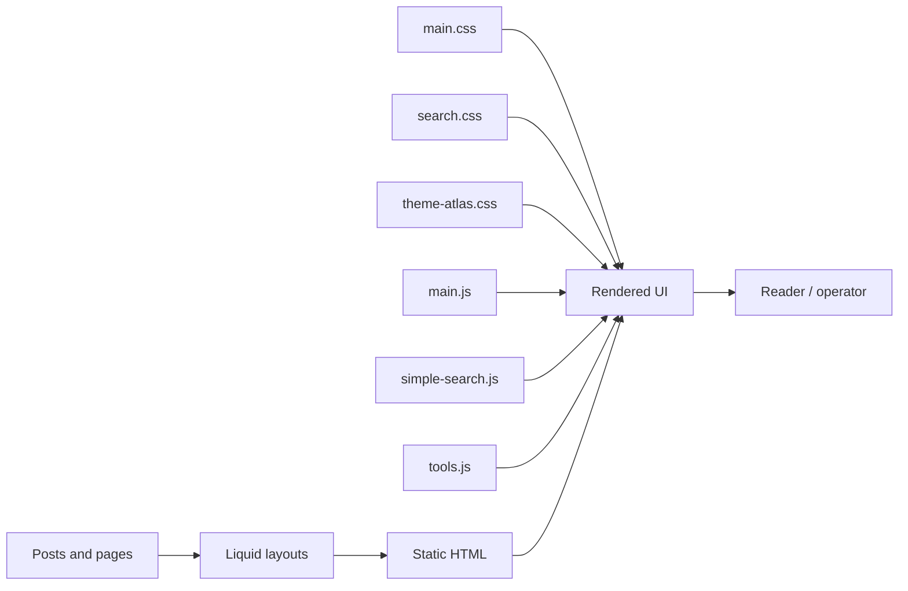
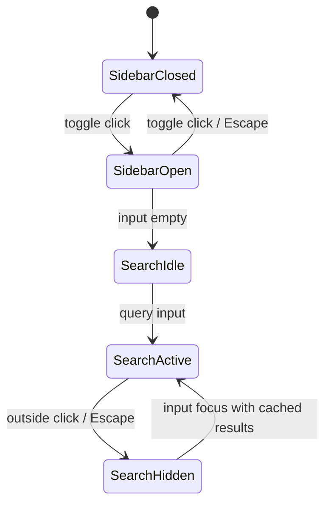

# 0. 현 상태 정리

저장소는 Jekyll/GitHub Pages 블로그이며, 커밋 `40d60a8`에서 민트 계열 레이아웃과 검색/사이드바 개선이 반영되었다. 현재 UI 품질은 `theme-atlas.css`가 최종 override 계층으로 담당한다.

# 1. 아키텍처 개요



# 2. 설계 원칙/의사결정

- 전역 품질 규칙은 `theme-atlas.css`에 둔다.
- 기존 Jekyll 구조와 GitHub Pages 호환성을 유지한다.
- 모바일은 본문 우선, 사이드바는 modal drawer로 취급한다.
- 검색은 정적 `/search.json` 기반 클라이언트 검색으로 유지한다.
- 운영 정책은 코드와 별도 Markdown 문서로 남긴다.

# 3. 모듈 분해

| 모듈 | 이름 | 책임 | 주요 파일 |
| --- | --- | --- | --- |
| M-001 | Design Token Override | 색상, 타이포, focus, contrast, 공통 레이아웃 토큰 | `assets/css/theme-atlas.css`, `DESIGN.md` |
| M-002 | Layout Normalizer | 포스트, 글 목록, 시리즈, 도구, about 폭/간격 통일 | `assets/css/theme-atlas.css` |
| M-003 | Search UI and Engine | 검색 입력, 결과 표시, URL q, 카테고리 라벨 | `_includes/components/search-form.html`, `assets/js/simple-search.js` |
| M-004 | Sidebar Drawer | 모바일 사이드바 상태, focus, inert, aria | `assets/js/main.js`, `assets/css/sidebar-toggle.css` |
| M-005 | Post Template | 작성일/갱신일, 학습 목표, 목차, 시리즈, 댓글 | `_layouts/post.html` |
| M-006 | Brand About and Logo | about 앱형 소개, 민트 고래 로고 fallback | `_pages/about.html`, `assets/images/mint-whale-logo.png` |
| M-007 | Content Metadata | 카테고리, 시리즈, front matter 정책 | `_posts/`, `_pages/*history.md`, `_data/` |
| M-008 | Tools Directory | 계산기 묶음, 개별 SEO 페이지, 입력/결과 UI | `_pages/tools.md`, `tools/*.md`, `assets/js/tools.js` |
| M-009 | Operations Docs | 운영 루틴, 콘텐츠 전략, 검토 보고서 | `BLOG_OPERATIONS.md`, `CONTENT_STRATEGY.md`, `docs/` |
| M-010 | Static Build Pipeline | Jekyll build, sitemap, feed, SEO output | `_config.yml`, `Gemfile`, `package.json` |
| M-011 | Analytics Events | GA4 이벤트, 개인정보 최소화 | `assets/js/analytics-events.js`, `BLOG_OPERATIONS.md` |
| M-012 | Image Loader | lazy 이미지 src/srcset/source[srcset], opacity fallback | `_includes/scripts.html`, `assets/css/theme-atlas.css` |
| M-013 | Navigation State | 하위 URL active 판정, `aria-current`, site title home link | `_includes/components/sidebar.html` |

# 4. 모듈별 상세 설계

## M-001 Design Token Override

- `:root`에 ink, paper, surface, teal, border, focus, content max-width를 정의한다.
- `a`, `button`, `input`, `select`, `textarea`에 일관된 font와 focus-visible을 적용한다.
- hover는 teal 계열로 유지하고 보라색은 주요 액션 전환에 사용하지 않는다.

## M-002 Layout Normalizer

- `.post`는 article max width를 사용한다.
- `.posts-container`, `.series-*`, `.tools-container`는 content max width를 사용한다.
- `.post-meta`, `.search-result-meta`는 flex wrap과 동일 gap을 사용한다.
- `.post-learning-outcomes`, `.table-of-contents`, `.series-navigation`은 동일한 panel 규칙을 공유한다.

## M-003 Search UI and Engine

- 검색 폼은 `type="text"`와 `inputmode="search"`를 사용해 브라우저 기본 clear와 custom clear 중복을 피한다.
- clear button은 query가 있을 때만 focus 가능하며, 검색 실행 버튼과 별도 역할을 가진다.
- URL `q`가 있으면 로드 후 검색어를 입력하고 결과를 계산한다.
- 검색 input focus 시 현재 query와 일치하는 기존 결과만 다시 표시한다.
- 사이드바 토글 클릭은 outside click으로 취급하지 않는다.
- 카테고리 키는 `formatCategoryLabel`로 사용자 라벨로 변환한다.
- Arrow key 탐색은 검색 input 또는 검색 결과 내부에 focus가 있을 때만 동작한다.

## M-004 Sidebar Drawer

- 모바일에서 사이드바는 fixed drawer다.
- 열림 상태에서 body는 `sidebar-modal-open`을 가진다.
- 본문 wrapper는 inert와 `aria-hidden`을 가진다.
- 닫힘 상태에서 sidebar는 `aria-hidden=true`다.
- 하위 페이지에서는 상위 navigation item에 active class와 `aria-current=location`을 부여한다.

## M-005 Post Template

- `date_modified` 또는 `last_modified_at`가 `date`와 다르면 갱신일을 표시한다.
- `learning_outcomes`는 최대 3개만 표시한다.
- TOC는 h2/h3 기준으로 생성한다.
- Utterances 댓글은 하단 `#comments`에 유지한다.

## M-006 Brand About and Logo

- sidebar와 about에서 같은 mint whale logo asset을 사용한다.
- 로고는 background-image와 background-color를 함께 사용해 asset 실패 시 레이아웃을 유지한다.
- about는 영어 app-like copy와 링크 리스트 중심으로 구성한다.

## M-008 Tools Directory

- `/tools/`는 개별 안내 링크와 통합 계산기를 모두 제공한다.
- 기본 계산기는 버튼 grid를 사용한다.
- 물리/단위 변환기는 form group, label, live result 영역을 사용한다.

# 5. 데이터 모델 설계

## Post front matter

```yaml
layout: post
title: "..."
date: 2024-09-19
date_modified: 2026-05-05
categories:
  - mathematics_philosophy_history
series: Mathematics-Philosophy-History
series_order: 9
learning_outcomes:
  - "..."
references:
  - title: "..."
    url: "..."
```

## Search result item

```json
{
  "title": "string",
  "url": "string",
  "date": "YYYY-MM-DD",
  "category": "mathematics_philosophy_history",
  "content": "plain text",
  "tags": ["string"]
}
```

# 6. API/인터페이스 설계

## DOM interfaces

- `#search-input`: 검색어 입력, `aria-expanded`, `aria-controls`
- `#search-results`: 검색 결과 region, `aria-live=polite`
- `.sidebar-toggle`: `aria-expanded`, `aria-controls=site-sidebar`
- `#site-sidebar`: `aria-hidden`, `tabindex=-1`
- `.tab-button`: `role=tab`, `aria-selected`, `aria-controls`

## JavaScript public surface

`simple-search.js`는 `window.searchFunctions`를 제공한다.

```js
window.searchFunctions = {
  initSearch,
  performSearch,
  clearSearch,
  updateUrl
};
```

# 7. 상태 전이/처리 흐름



# 8. 에러 처리 설계

- 검색 데이터 로딩 실패: 결과 영역에 한국어 오류 메시지 표시.
- 검색 결과 없음: 다른 검색어 안내 표시.
- 계산기 입력 오류: `role=alert` 또는 live result 영역에 안내 표시.
- 이미지 실패: 배경색 fallback 유지.

# 9. 관측성/운영 고려사항

- GA4 이벤트는 개인정보를 제외한다.
- Search Console은 월 1회 점검한다.
- 배포 후 주요 페이지와 sitemap을 확인한다.
- 리뷰 보고서는 `docs/`에 누적한다.

# 10. 보안 고려사항

- 검색 결과 HTML 생성 시 title, URL, category, tags는 escape 처리한다.
- 외부 링크는 `rel="noopener noreferrer"`를 사용한다.
- GA4 이벤트에 검색어 원문, 이메일, 토큰을 포함하지 않는다.

# 11. 구현 순서

1. 전역 theme override 정리.
2. 검색 버튼 중복 제거 및 결과 표시 상태 수정.
3. 포스트/글 목록/시리즈/도구 레이아웃 정규화.
4. 빌드, 브라우저 smoke, 대비 확인.
5. PRD/HLD/LLD/TDD/ADR/검토 보고서 작성.
6. 문서 변경 커밋 및 푸시.

# 12. 요구사항/테스트/모듈 추적표

| R | T | M |
| --- | --- | --- |
| R-001 | T-001, T-009 | M-001 |
| R-002 | T-002, T-010 | M-002, M-005 |
| R-003 | T-003, T-011 | M-003 |
| R-004 | T-004 | M-003, M-007 |
| R-005 | T-005, T-012 | M-004 |
| R-006 | T-006 | M-006 |
| R-007 | T-007 | M-008 |
| R-008 | T-008 | M-005, M-007 |
| R-009 | T-013 | M-009 |
| R-010 | T-014 | M-001, M-009 |
| R-011 | T-015 | M-012 |
| R-012 | T-016 | M-004, M-013 |
| R-NF-001 | T-NF-001 | M-010 |
| R-NF-002 | T-NF-002 | M-001 |
| R-NF-003 | T-NF-003 | M-001, M-004 |
| R-NF-004 | T-NF-004 | M-001, M-002 |
| R-NF-005 | T-NF-005 | M-011 |
| R-NF-006 | T-NF-006 | M-006 |

# 13. 리스크/미결 이슈

- `DESIGN.md` 토큰이 최신 CSS 토큰과 일부 다르다.
- 페이지별 인라인 style 제거 또는 통합은 별도 리팩터링으로 분리하는 것이 안전하다.
- E2E 테스트 파일은 아직 저장소에 구현되어 있지 않다.

# 14. 변경 이력

| 날짜 | 버전 | 작성자 | 변경 |
| --- | --- | --- | --- |
| 2026-05-05 | v1 | Codex | 초기 LLD 작성 |
